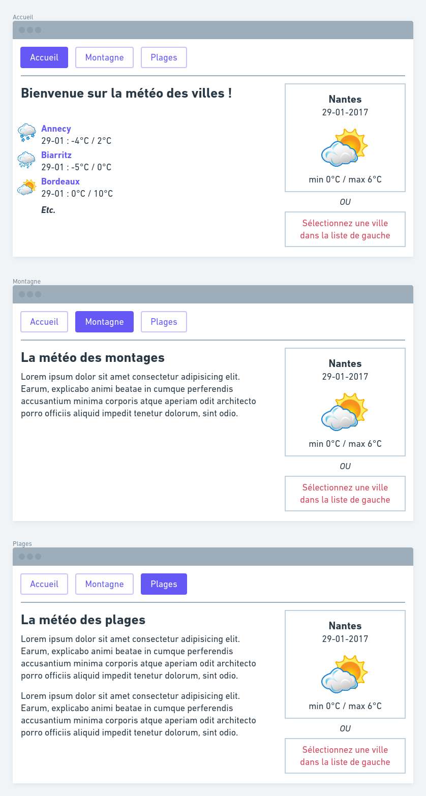

# Prévisions météo du jour

## Objectifs

- Créer une page de prévisions météo du jour, et son _widget_.
    - Ce dernier affichera la prévision météo d'une ville sur toutes les pages du site (une fois celle-ci sélectionnée).
- Utiliser les notions vues jusqu'ici : Install, Routing, Contrôleur, Twig, Session.

### Les wireframes de l'application

### Les étapes possibles

- **Afficher la liste** des villes depuis l'accueil.
- Cliquer sur une ville pour **mettre cette ville dans le widget**.
    - Mettre les infos de la ville en session et rediriger vers l'accueil.
- Dans le widget météo :
    - **Afficher la prévision météo** du jour (ville, date, température min/max, image météo), **de la ville choisie**.
    - **Sinon afficher un message + un lien** pour choisir une ville sur l'accueil.
- Créer une navigation pour les 3 pages.
- CSS au choix : aucune, _maison_, framework CSS de votre choix.

### Modèle de données fourni

Le modèle fourni `WeatherModel.php` contient déjà des données (tableau PHP) et vous propose 2 méthodes statiques pour les récupérer :

**Toutes les villes**

`$data = WeatherModel::getWeatherData();`

**Les données pour une ville**

Pour la ville en index numéro 5 :

`$city = WeatherModel::getWeatherByCityIndex(5);`
